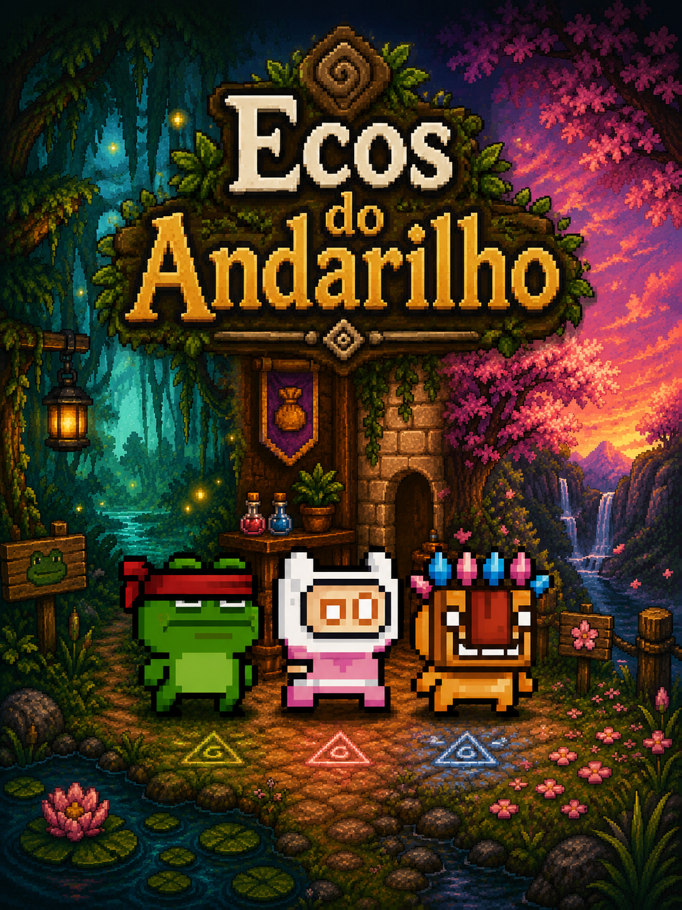
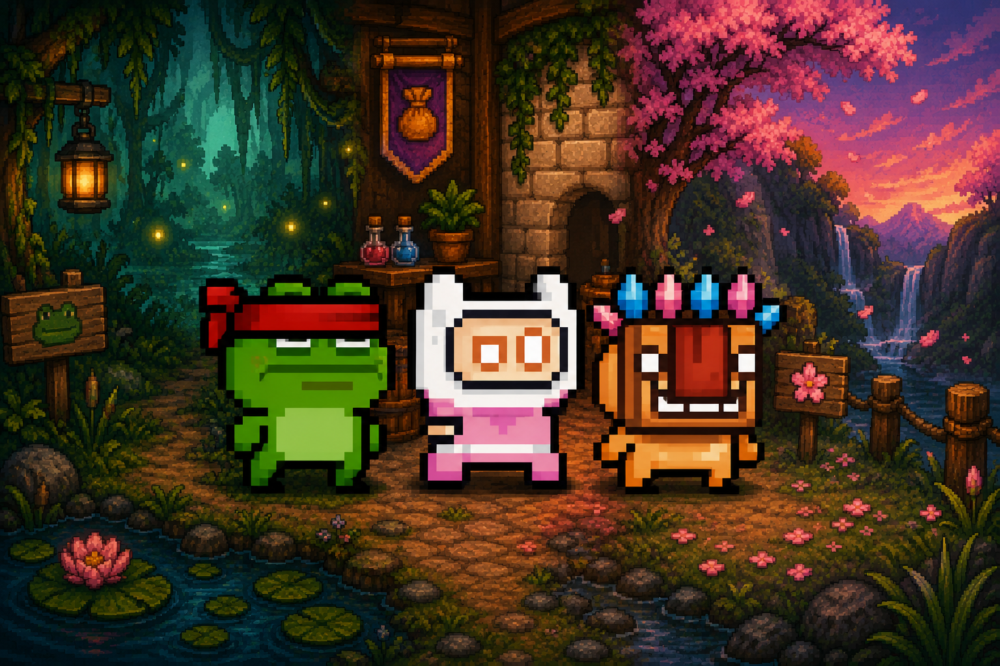

<div align="center">

# 🌌 **ECOS DO ANDARILHO**

### 🎮 *Um jogo de plataforma rítmico onde a música guia cada movimento.*

<br/>



<br/>
<br/>


</div>

### 🎮 *Um jogo de plataforma rítmico onde a música guia cada movimento.*

<br/>


<br/>

> ### ⚡ “Cada salto deixa um eco.”

</div>

---

# 🎮 Sobre o Projeto

**Ecos do Andarilho** é um jogo de plataforma rítmico desenvolvido utilizando **Construct 3**, combinando gameplay clássica, pixel art e sincronização musical em uma experiência Neo-Retro moderna.

O projeto foi criado como trabalho acadêmico para a disciplina de **Desenvolvimento Mobile**, com o objetivo de unir:

* 🎵 gameplay sincronizada com música;
* 🕹️ movimentação fluida;
* 🌌 ambientação imersiva;
* ⚡ obstáculos dinâmicos;
* 🎨 identidade visual estilizada;
* 📱 compatibilidade mobile;
* ✨ experiência visual moderna.

A proposta principal do jogo é transformar a música em mecânica, fazendo com que o jogador acompanhe o ritmo do cenário para superar plataformas, inimigos e obstáculos dinâmicos.

---

<div align="center">

# 🌠 EXPERIÊNCIA VISUAL



</div>

---

# ⚡ Gameplay

<div align="center">

# 🎵 Plataforma Rítmica

</div>

A gameplay gira em torno da sincronização entre:

* movimentação;
* saltos;
* timing;
* plataformas móveis;
* obstáculos dinâmicos;
* comportamento dos inimigos.

Cada fase possui:

* ritmo próprio;
* velocidade diferente;
* ambientação única;
* desafios progressivos;
* mecânicas específicas.

---

# 🌍 Mundos do Jogo

<div align="center">

| Mundo                   | Tema          | Destaque           |
| ----------------------- | ------------- | ------------------ |
| 🌳 **Floresta Viva**    | Introdução    | Gameplay básica    |
| 🏛️ **Ruínas Antigas**  | Verticalidade | Exploração         |
| ☁️ **Reino das Nuvens** | Precisão      | Plataformas móveis |
| 🔥 **Covil Final**      | Boss Battle   | Ritmo acelerado    |

</div>

---

# 🦸 Personagens

<div align="center">

# ⚔️ HERÓIS

</div>

---

## ⚔️ Kaelen — O Salteador

> *“O ritmo certo transforma qualquer salto em vitória.”*

### Características

* Gameplay equilibrada;
* movimentação clássica;
* foco em precisão;
* física refinada.

### Mecânicas

* Ajuste manual de gravidade;
* controle refinado de salto;
* movimentação responsiva.

---

## 🌪️ Lyra — Tecelã das Nuvens

> *“A gravidade também dança.”*

### Características

* Controle gravitacional;
* mobilidade aérea;
* gameplay dinâmica;
* movimentação avançada.

### Mecânicas

* Manipulação de gravidade;
* física adaptativa;
* movimentação aérea.

---

## 🛡️ Grom — Guardião de Pedra

> *“Montanhas não recuam.”*

### Características

* Resistência elevada;
* sistema de shield;
* absorção de dano;
* gameplay defensiva.

### Mecânicas

* Variáveis booleanas;
* controle de dano;
* troca dinâmica de animações.

---

# 🎨 Direção Artística

A identidade visual do projeto foi inspirada em:

* 🎮 jogos clássicos de plataforma;
* 🌌 interfaces Neo-Retro;
* ✨ pixel art moderna;
* 📺 experiências indie contemporâneas;
* 🎨 paletas vibrantes;
* 🌠 ambientações imersivas.

---

<div align="center">

# ✨ ELEMENTOS VISUAIS

</div>

* Pixel Art;
* Parallax;
* Paleta vibrante;
* Cenários estilizados;
* Atmosfera imersiva;
* Feedback visual dinâmico;
* Interface Neo-Retro;
* HUD inspirada em jogos arcade.

---

# 🧠 Tecnologias Utilizadas

<div align="center">

| Tecnologia        | Finalidade                |
| ----------------- | ------------------------- |
| Construct 3       | Desenvolvimento principal |
| HTML5 Export      | Build Web                 |
| Platform Behavior | Física principal          |
| Touch Plugin      | Controles mobile          |
| Event Sheets      | Sistema de lógica         |
| Sine Behavior     | Plataformas dinâmicas     |

</div>

---

# 📱 Compatibilidade

<div align="center">

| Plataforma              | Suporte |
| ----------------------- | ------- |
| 💻 Desktop              | ✅       |
| 📱 Smartphones          | ✅       |
| 📲 Tablets              | ✅       |
| 🌐 Navegadores modernos | ✅       |

</div>

---

# ⚙️ Estrutura do Projeto

```bash id="eqqp7q"
jogo_aula_de_mobile/
│
├── game/
│   └── jogo.html
│
├── images/
│   ├── chars/
│   ├── ui/
│   └── devs/
│
├── css/
│
├── js/
│
└── README.md
```

---

# 🚀 Execução Local

## Clone o projeto

```bash id="9y9d3o"
git clone https://github.com/gustavo-almeidalopes/jogo_aula_de_mobile.git
```

---

## Acesse a pasta

```bash id="mx3c04"
cd jogo_aula_de_mobile
```

---

## Execute

Abra o arquivo:

```bash id="4v3wr7"
game/jogo.html
```

---

# 📈 Destaques Técnicos

## 🎵 Sistema Rítmico

Sincronização de gameplay utilizando lógica temporal dentro do Construct 3.

## 📱 Mobile Support

Compatibilidade com dispositivos móveis utilizando Touch Plugin.

## ⚡ Performance

Projeto otimizado visando:

* carregamento rápido;
* gameplay fluida;
* baixa latência;
* boa experiência mobile.

## 🎨 Identidade Visual

Direção artística inspirada em jogos indie modernos e pixel art clássica.

---

# 👨‍💻 Desenvolvimento

<div align="center">

| Desenvolvedor  | Função                               |
| -------------- | ------------------------------------ |
| Gustavo Lopes  | UX/UI Designer • Front-end Developer |
| Erick Oliveira | Construct 3 Game Developer           |

</div>

---

## Gustavo Lopes

Responsável por:

* identidade visual;
* documentação;
* estrutura visual;
* experiência do usuário;
* organização do projeto.

---

## Erick Oliveira

Responsável por:

* gameplay;
* mapas;
* física;
* mecânicas;
* lógica do jogo;
* sistemas de movimentação.

---

# 📄 Licença

Este projeto está licenciado sob a licença MIT.

---

<div align="center">

# 🌌 ECOS DO ANDARILHO

### *“O ritmo guia o caminho.”*

<br/>


<br/>

<sub>Projeto acadêmico desenvolvido utilizando Construct 3.</sub>

</div>
